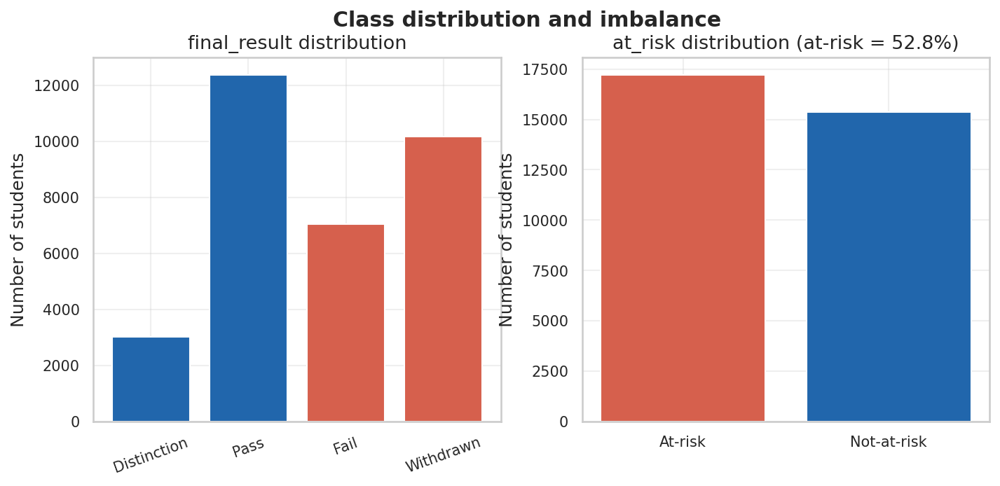
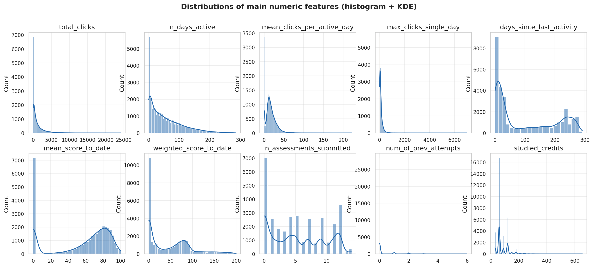
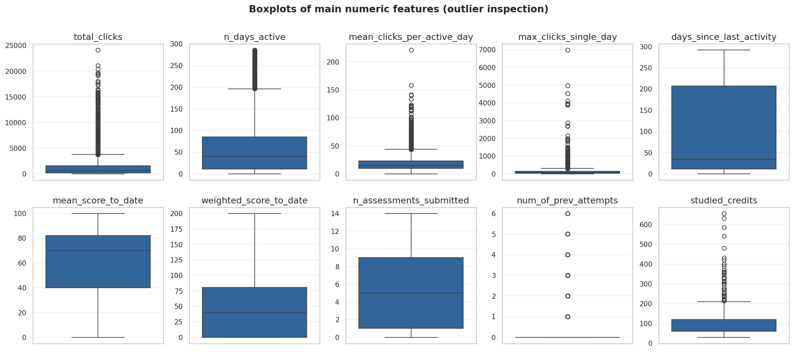
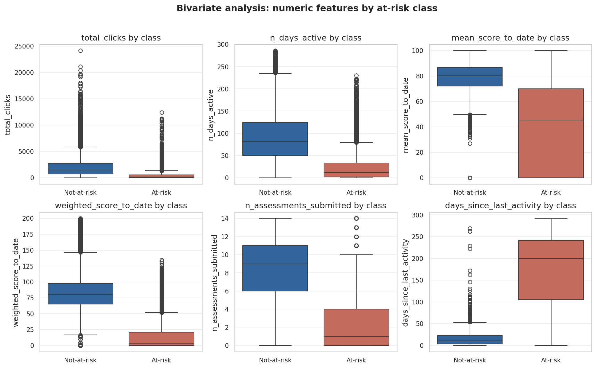
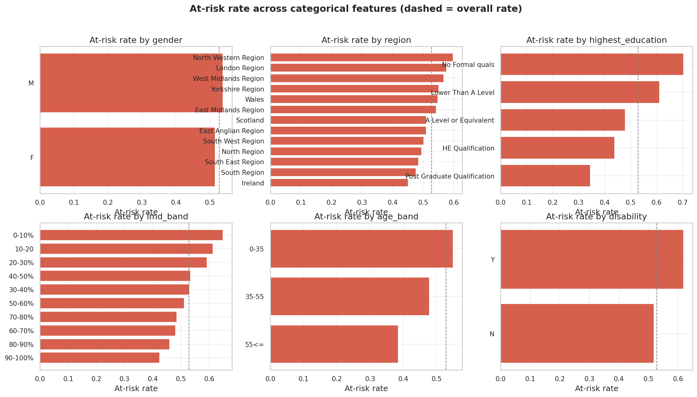
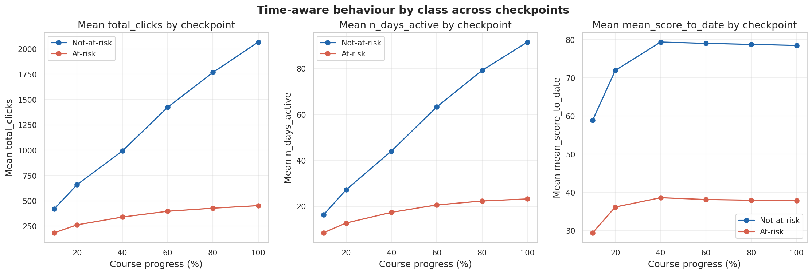

# Báo cáo 2 — Tác vụ dữ liệu: Thu thập, Làm sạch và Phân tích khám phá

**DSP391m – Đồ án Khoa học Dữ liệu · Nhóm 1 · Đại học FPT**
*Đề tài: Time-Aware Explainable Machine Learning for Early At-Risk Student Prediction on OULAD · GVHD: Nguyễn Thị Hoàng Yến*
*Phạm vi: CLO3–CLO4 · Chương 3 (Thu thập & Làm sạch) và Chương 4 (EDA). Bản thảo này tổng hợp các sản phẩm của nhóm; các tài liệu chi tiết riêng được tham chiếu trong bài.*

---

## Chương 3 — Thu thập và làm sạch dữ liệu

### 3.1 Nguồn dữ liệu, giấy phép và đạo đức

Đề tài sử dụng **Open University Learning Analytics Dataset (OULAD)** (Kuzilek và cộng sự, 2017 [3]): **32.593** bản ghi sinh viên–môn–kỳ trên **22** môn–kỳ và **7** bảng quan hệ, gồm ba nhóm đặc trưng (nhân khẩu học, tương tác/VLE, kết quả đánh giá) và biến kết quả `final_result`. OULAD đã được **ẩn danh tại nguồn** và phân phối theo **CC-BY 4.0**, nên yêu cầu đạo đức được đáp ứng bằng việc trích dẫn đúng quy cách; không xử lý dữ liệu cá nhân nhạy cảm. Phân tích phương pháp thu thập và lý do dùng dữ liệu thứ cấp công khai nằm trong `docs/03_DataCollection_Methods`; phần nguồn/giấy phép/đạo đức trong `docs/DataSource_License_Ethics`.

### 3.2 Định nghĩa biến mục tiêu

Bài toán là **phân loại nhị phân**. Nhãn suy ra từ `final_result` và **cố định qua mọi mốc**:

| Lớp | Giá trị | Số lượng | Tỉ lệ |
|---|---|---|---|
| not-at-risk (0) | Pass (12.361) + Distinction (3.024) | 15.385 | 47,2% |
| at-risk (1) | Fail (7.052) + Withdrawn (10.156) | 17.208 | **52,8%** |

Lớp at-risk là **đa số nhẹ** (mất cân bằng nhẹ); con số 68/32 trên slide chỉ mang tính minh hoạ. Lập luận đầy đủ và quy ước xử lý Withdrawn theo thời gian (**Phương án A**: nhãn cố định, quần thể cố định, giữ Withdrawn-trước-*t* là at-risk) nằm trong `docs/01_TargetVariable_Definition` (biên bản BB-B0-N1).

### 3.3 Tích hợp dữ liệu — bảng hợp nhất

Bảy bảng được hợp nhất thành một **bảng phẳng**, mỗi dòng một sinh viên–môn–kỳ. `studentInfo` làm bảng nền; bảng đăng ký, bảng tương tác đã tổng hợp và bảng kết quả đã tổng hợp được nối bằng **left join**; **nhật ký kết nối** trước/sau chứng minh tính toàn vẹn:

| Bước | rows_before | rows_after | n_students |
|---|---|---|---|
| studentInfo (nền) | 32.593 | 32.593 | 28.785 |
| + registration | 32.593 | 32.593 | 28.785 |
| + engagement | 32.593 | 32.593 | 28.785 |
| + performance | 32.593 | 32.593 | 28.785 |

Không dòng nào bị nhân bản hay thất thoát. **Đặc trưng tương tác** được tổng hợp từ clickstream `studentVle` (**10.655.280** dòng, nối với `vle` để lấy loại hoạt động): `total_clicks`, `n_days_active`, tám cột `clicks_<loại>`, `max_clicks_single_day`, `mean_clicks_per_active_day`, và `days_since_last_activity`. **Đặc trưng kết quả** được tổng hợp từ `studentAssessment` kèm trọng số/hạn nộp: `mean_score_to_date`, `weighted_score_to_date`, `n_assessments_submitted`, và cờ nguy cơ `not_submitted` (đã qua hạn mà chưa nộp). Kết quả: **master_raw = 32.593 × 33 cột** (`src/data/build_master_table.py`, notebook `01`).

### 3.4 Làm sạch dữ liệu

- **Trùng lặp:** 0 khoá tổng hợp trùng sau `drop_duplicates`.
- **Nhất quán:** nhãn phân loại được chuẩn hoá; số giá trị khớp từ điển dữ liệu (region 13, education 5, imd_band 10, age_band 3, gender/disability 2).
- **Giá trị khuyết:** `imd_band` (1.111) → `"Unknown"`; điểm khuyết do chưa nộp → 0 kèm cờ `not_submitted` (một *tín hiệu*, không phải nhiễu); `date_registration` (45) → trung vị train. Khoảng khuyết lớn duy nhất, `date_unregistration` (22.521), là **bình thường** — đa số sinh viên không rút môn — và không dùng làm đặc trưng.
- **Ngoại lai:** đặc trưng clickstream lệch phải dùng `log1p`; còn lại dùng `winsorize`; **không loại bỏ dòng nào** (`src/features/preprocessing.py`, `docs/07_Preprocessing_Sequence`).

### 3.5 Trích đặc trưng theo thời gian

Thời lượng các môn khác nhau, nên mỗi phần trăm tiến độ được quy đổi ra ngày cụ thể: `cutoff_day = round(module_presentation_length × t / 100)` cho `t ∈ {10,20,40,60,80,100}` (`data/checkpoint_map.csv`, 22×6 dòng). `cut_at_checkpoint()` chỉ giữ sự kiện tại hoặc trước ngày mốc, và pipeline hợp nhất được chạy lại cho từng mốc để tạo **sáu bộ dữ liệu** (`dataset_t10 … dataset_t100`), mỗi bộ **32.593 dòng** dùng chung **một danh sách sinh viên** (Phương án A). Tỉ lệ at-risk cố định 52,8% qua các mốc (nhãn cố định); chỉ đặc trưng tương tác/kết quả thay đổi theo *t*.

### 3.6 Phòng tránh rò rỉ và phân chia

Hai trục rò rỉ được kiểm soát. Trên trục **thời gian**, ba quy tắc (loại bài nộp sau mốc; loại click sau mốc; giữ Withdrawn-trước-*t* là at-risk) được nêu trong `docs/02_LeakagePrevention_Rules`. Trên trục **đặc trưng**, trình tự **phân chia → điền khuyết → ngoại lai → mã hoá/chuẩn hoá → tái lấy mẫu** chỉ khớp mọi bộ học trên fold huấn luyện (`docs/07_Preprocessing_Sequence`). Phân chia **bảo toàn nhóm (theo `id_student`) + phân tầng** với **tập kiểm tra 20% cố định** dùng lại qua các mốc (`docs/06_SplitStrategy_Analysis`): train ≈ 26.104 dòng, test ≈ 6.489 dòng, **0 sinh viên trùng**, tỉ lệ lớp 0,53/0,52. CV trên tập huấn luyện dùng **5-fold × 5 seed**; chỉ số chính là **PR-AUC** và **recall** trên lớp at-risk. `tests/test_leakage.py` khẳng định toàn bộ: **16/16 kiểm thử đạt**.

### 3.7 Khả năng tái lập

`RANDOM_SEED = 42` xuyên suốt; nguồn gốc trong `data/data_manifest.txt` (MD5 + dung lượng + ngày); môi trường ghim trong `requirements.txt`/`environment.yml`; notebook chạy *Restart & Run All*; các bước dài có checkpoint/resume; ghi parquet nguyên tử. Quy trình đầy đủ trong `docs/10_Reproducibility`.

---

## Chương 4 — Phân tích khám phá dữ liệu

Mọi biểu đồ tuân theo quy chuẩn của nhóm (`docs/08_Chart_Standards`); mã phân tích trong `src/eda/eda.py` (notebook `02`).

### 4.1 Phân phối lớp và mất cân bằng (STT 27)

Tỉ lệ at-risk thực tế là **52,8%** (tỉ số mất cân bằng 1,12 — nhẹ). Điều này loại bỏ giả định mất cân bằng nghiêm trọng nhưng vẫn biện minh cho PR-AUC/recall, vì **lớp dương at-risk là lớp không được bỏ sót**.

### 4.2 Thống kê mô tả (STT 28)

Đặc trưng tương tác **lệch phải mạnh** — `max_clicks_single_day` (độ lệch 10,6), `total_clicks` (3,0), `mean_clicks_per_active_day` (1,6) — biện minh thực nghiệm cho phép biến đổi `log1p`. Bảng đầy đủ: `reports/eda_descriptive_stats.csv`.

### 4.3 Phân tích song biến với biến mục tiêu (STT 36)

Chênh lệch trung bình chuẩn hoá (|Cohen's d|) giữa hai lớp xếp hạng các đặc trưng **phân biệt** mạnh nhất:

| Đặc trưng | \|Cohen's d\| |
|---|---|
| days_since_last_activity | 2,55 |
| n_assessments_submitted | 2,05 |
| weighted_score_to_date | 1,96 |
| n_days_active | 1,58 |
| mean_score_to_date | 1,58 |

Đặc trưng tương tác và kết quả chiếm ưu thế; đặc trưng nhân khẩu học yếu (`studied_credits` 0,28, `num_of_prev_attempts` 0,21).

### 4.4 Phân tích tương quan (STT 37)

Tương quan mạnh nhất với mục tiêu: `days_since_last_activity` (r=0,78), `n_assessments_submitted` (0,72), `weighted_score_to_date` (0,71), `n_days_active` (0,63). Cặp đặc trưng–đặc trưng mạnh nhất là `n_days_active`–`total_clicks` (0,84). **Không đặc trưng nào tương quan ≥0,95 với mục tiêu**, nên không có đặc trưng nghi rò rỉ.

### 4.5 EDA theo thời gian (STT 38)

Khoảng cách giữa hai lớp ở trung bình `total_clicks` mở rộng đơn điệu — **237 → 397 → 653 → 1.027 → 1.340 → 1.616** từ t=10%→100% — và `n_days_active` cũng vậy. Khoảng cách điểm trung bình **bão hoà quanh t≈40%** (29,5 → 35,8 → 40,8 rồi phẳng).

### 4.6 Các phát hiện chính và giả thuyết

1. **F1 (RQ1) — tồn tại tín hiệu sớm.** Tương tác phân biệt hai lớp từ **t=10–20%** và tín hiệu điểm gần như xác lập tại **t≈40%**, ủng hộ khả năng dự đoán sớm đáng tin quanh 40–60% (nhất quán với Adnan và cộng sự [1]).
2. **F2 (RQ1/RQ2) — hành vi > nhân khẩu học.** `days_since_last_activity`, việc nộp bài và điểm tích luỹ là các yếu tố phân biệt hàng đầu, trong khi nhân khẩu học yếu, khớp với Tomasevic và cộng sự [2]; điều này định hướng trọng tâm đặc trưng và kỳ vọng về các đặc trưng SHAP/LIME nên xếp hạng cao (RQ2).
3. **F3 (RQ3) — mất cân bằng nhẹ.** Ở mức 52,8% at-risk, tái lấy mẫu mạnh có thể chỉ cải thiện vừa phải; RQ3 sẽ so sánh none/class-weight/SMOTE/ADASYN với mốc cơ sở này bằng PR-AUC/recall.
4. **F4 (RQ2) — đặc trưng tương tác tương quan cao.** Các đặc trưng tương tác tương quan cao (ví dụ `total_clicks`–`n_days_active`, r=0,84) có thể khiến SHAP/LIME phân tán độ quan trọng giữa chúng, một yếu tố cần theo dõi khi đo độ ổn định giải thích (RQ2).

---

## Tài liệu tham khảo

1. M. Adnan và cộng sự, "Predicting at-Risk Students at Different Percentages of Course Length for Early Intervention," *IEEE Access*, vol. 9, tr. 7519–7539, 2021.
2. N. Tomasevic, N. Gvozdenovic, S. Vranes, "An overview and comparison of supervised data mining techniques for student exam performance prediction," *Computers & Education*, vol. 143, art. 103676, 2020.
3. J. Kuzilek, M. Hlosta, Z. Zdrahal, "Open University Learning Analytics dataset," *Scientific Data*, vol. 4, art. 170171, 2017.
4. S. Gunasekara, M. Saarela, "Explainable AI in Education: Techniques and Qualitative Assessment," *Applied Sciences*, 2025.
8. N. V. Chawla và cộng sự, "SMOTE: Synthetic Minority Over-sampling Technique," *JAIR*, 2002.
