# Báo cáo 2 — Tác vụ dữ liệu: Thu thập, Làm sạch và Phân tích khám phá

**DSP391m – Đồ án Khoa học Dữ liệu · Nhóm 1 · Đại học FPT**
*Đề tài: Time-Aware Explainable Machine Learning for Early At-Risk Student Prediction on OULAD · GVHD: Nguyễn Thị Hoàng Yến*
*Phạm vi: CLO3–CLO4 · Chương 3 (Thu thập & Làm sạch) và Chương 4 (EDA). Bản thảo này tổng hợp các sản phẩm của nhóm; các tài liệu chi tiết riêng được tham chiếu trong bài.*

---

## Chương 3 — Thu thập và làm sạch dữ liệu

### 3.1 Nguồn dữ liệu, giấy phép và đạo đức

Đề tài sử dụng **Open University Learning Analytics Dataset (OULAD)** (Kuzilek và cộng sự, 2017 [3]): **32.593** bản ghi sinh viên–môn–kỳ trên **22** môn–kỳ và **7** bảng quan hệ, gồm ba nhóm đặc trưng (nhân khẩu học, tương tác/VLE, kết quả đánh giá) và biến kết quả `final_result`. OULAD đã được **ẩn danh tại nguồn** và phân phối theo **CC-BY 4.0**, nên yêu cầu đạo đức được đáp ứng bằng việc trích dẫn đúng quy cách; không xử lý dữ liệu cá nhân nhạy cảm. Phân tích phương pháp thu thập và lý do dùng dữ liệu thứ cấp công khai nằm trong `docs/02_collection/Data_Collection_Methods`; phần nguồn/giấy phép/đạo đức trong `docs/02_collection/Data_Source_License_Ethics`.

### 3.2 Định nghĩa biến mục tiêu

Bài toán là **phân loại nhị phân**. Nhãn suy ra từ `final_result` và **cố định qua mọi mốc**:

| Lớp | Giá trị | Số lượng | Tỉ lệ |
|---|---|---|---|
| not-at-risk (0) | Pass (12.361) + Distinction (3.024) | 15.385 | 47,2% |
| at-risk (1) | Fail (7.052) + Withdrawn (10.156) | 17.208 | **52,8%** |

Lớp at-risk là **đa số nhẹ** (mất cân bằng nhẹ); con số 68/32 trên slide chỉ mang tính minh hoạ. Lập luận đầy đủ và quy ước xử lý Withdrawn theo thời gian (**Phương án A**: nhãn cố định, quần thể cố định, giữ Withdrawn-trước-*t* là at-risk) nằm trong `docs/01_data_specification/Target_Variable_Definition` (biên bản BB-B0-N1).

### 3.3 Tích hợp dữ liệu — bảng hợp nhất

Bảy bảng được hợp nhất thành một **bảng phẳng**, mỗi dòng một sinh viên–môn–kỳ. `studentInfo` làm bảng nền; bảng đăng ký, bảng tương tác đã tổng hợp và bảng kết quả đã tổng hợp được nối bằng **left join**; **nhật ký kết nối** trước/sau chứng minh tính toàn vẹn:

| Bước | rows_before | rows_after | n_students |
|---|---|---|---|
| studentInfo (nền) | 32.593 | 32.593 | 28.785 |
| + registration | 32.593 | 32.593 | 28.785 |
| + engagement | 32.593 | 32.593 | 28.785 |
| + performance | 32.593 | 32.593 | 28.785 |

Không dòng nào bị nhân bản hay thất thoát. **Đặc trưng tương tác** được tổng hợp từ clickstream `studentVle` (**10.655.280** dòng, nối với `vle` để lấy loại hoạt động): `total_clicks`, `n_days_active`, tám cột `clicks_<loại>`, `max_clicks_single_day`, `mean_clicks_per_active_day`, và `days_since_last_activity`. **Đặc trưng kết quả** được tổng hợp từ `studentAssessment` kèm trọng số/hạn nộp: `mean_score_to_date`, `weighted_score_to_date`, `n_assessments_submitted`, và cờ nguy cơ `not_submitted` (đã qua hạn mà chưa nộp). Kết quả: **master_raw = 32.593 × 33 cột** (`src/data/build_master_table.py`, notebook `01`).

### 3.4 Làm sạch dữ liệu

- **Trùng lặp:** 0 khoá tổng hợp trùng sau `drop_duplicates`.
- **Nhất quán:** nhãn phân loại được chuẩn hoá; số giá trị khớp từ điển dữ liệu (region 13, education 5, imd_band 10, age_band 3, gender/disability 2).
- **Giá trị khuyết:** `imd_band` (1.111) → `"Unknown"`; điểm khuyết do chưa nộp → 0 kèm cờ `not_submitted` (một *tín hiệu*, không phải nhiễu); `date_registration` (45) → trung vị train. Khoảng khuyết lớn duy nhất, `date_unregistration` (22.521), là **bình thường** — đa số sinh viên không rút môn — và không dùng làm đặc trưng.
- **Ngoại lai:** đặc trưng clickstream lệch phải dùng `log1p`; còn lại dùng `winsorize`; **không loại bỏ dòng nào** (`src/features/preprocessing.py`, `docs/04_transformation/Preprocessing_Sequence`).

### 3.5 Trích đặc trưng theo thời gian

Thời lượng các môn khác nhau, nên mỗi phần trăm tiến độ được quy đổi ra ngày cụ thể: `cutoff_day = round(module_presentation_length × t / 100)` cho `t ∈ {10,20,40,60,80,100}` (`data/checkpoint_map.csv`, 22×6 dòng). `cut_at_checkpoint()` chỉ giữ sự kiện tại hoặc trước ngày mốc, và pipeline hợp nhất được chạy lại cho từng mốc để tạo **sáu bộ dữ liệu** (`dataset_t10 … dataset_t100`), mỗi bộ **32.593 dòng** dùng chung **một danh sách sinh viên** (Phương án A). Tỉ lệ at-risk cố định 52,8% qua các mốc (nhãn cố định); chỉ đặc trưng tương tác/kết quả thay đổi theo *t*.

### 3.6 Phòng tránh rò rỉ và phân chia

Hai trục rò rỉ được kiểm soát. Trên trục **thời gian**, ba quy tắc (loại bài nộp sau mốc; loại click sau mốc; giữ Withdrawn-trước-*t* là at-risk) được nêu trong `docs/03_cleaning/Leakage_Prevention_Rules`. Trên trục **đặc trưng**, trình tự **phân chia → điền khuyết → ngoại lai → mã hoá/chuẩn hoá → tái lấy mẫu** chỉ khớp mọi bộ học trên fold huấn luyện (`docs/04_transformation/Preprocessing_Sequence`). Phân chia **bảo toàn nhóm (theo `id_student`) + phân tầng** với **tập kiểm tra 20% cố định** dùng lại qua các mốc (`docs/05_splitting/Split_Strategy_Analysis`): train ≈ 26.104 dòng, test ≈ 6.489 dòng, **0 sinh viên trùng**, tỉ lệ lớp 0,53/0,52. CV trên tập huấn luyện dùng **5-fold × 5 seed**; chỉ số chính là **PR-AUC** và **recall** trên lớp at-risk. `tests/test_leakage.py` khẳng định toàn bộ: **16/16 kiểm thử đạt**.

### 3.7 Khả năng tái lập

`RANDOM_SEED = 42` xuyên suốt; nguồn gốc trong `data/data_manifest.txt` (MD5 + dung lượng + ngày); môi trường ghim trong `requirements.txt`/`environment.yml`; notebook chạy *Restart & Run All*; các bước dài có checkpoint/resume; ghi parquet nguyên tử. Quy trình đầy đủ trong `docs/07_standards/Reproducibility`.

---

## Chương 4 — Phân tích khám phá dữ liệu

Mọi so sánh đều có kiểm định thống kê phù hợp, không chỉ dựa vào cảm quan: kiểm định **Mann-Whitney U** (hiệu chỉnh Benjamini-Hochberg) kèm **Cohen's d** cho biến định lượng; **chi-square** kèm **Cramér's V** cho biến phân loại; tương quan Pearson/Spearman kèm kiểm tra rò rỉ. Biểu đồ tuân theo quy chuẩn (`docs/07_standards/Chart_Standards`); mã phân tích là `src/eda/eda.py`, được thuyết minh trong notebook `02`, các bảng kết quả ở `reports/tables/`.

### 4.0 Chất lượng dữ liệu

Chỉ ba cột có khuyết: `date_unregistration` (22.521 — thiếu mang tính cấu trúc với sinh viên không rút môn, không là đặc trưng), `imd_band` (1.111 → `Unknown`) và `date_registration` (45 → trung vị train). Không cột đặc trưng nào thiếu đáng kể.

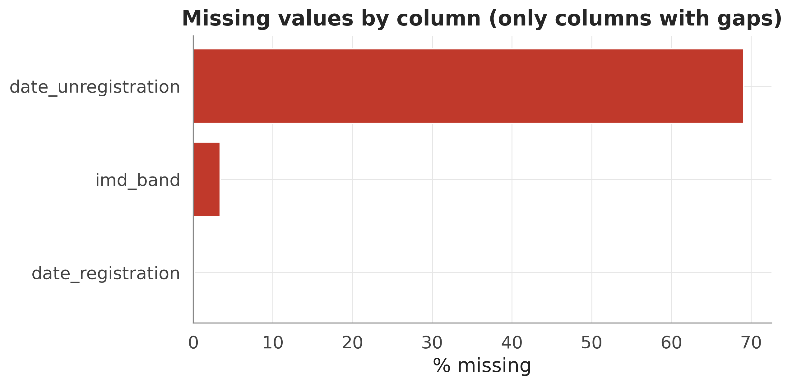

### 4.1 Phân phối lớp và mất cân bằng (STT 27)

Tỉ lệ at-risk quan sát được là **52,8%** (tỉ số mất cân bằng 1,12) — đa số nhẹ, không phải con số minh hoạ 68/32. Mất cân bằng là nhẹ (báo cáo trung thực; định hình RQ3); PR-AUC và recall trên lớp at-risk vẫn là chỉ số chính vì bỏ sót sinh viên nguy cơ là sai lầm tốn kém nhất.

### 4.2 Mô tả đơn biến (STT 28)

Đặc trưng tương tác lệch phải mạnh và đuôi nặng — `clicks_resource` (độ lệch ≈ 35, độ nhọn ≈ 2.125), `clicks_url` (độ lệch ≈ 13), `max_clicks_single_day` (độ lệch ≈ 11) — biện minh thực nghiệm cho phép biến đổi `log1p` ở bước làm sạch. Bảng đầy đủ (trung bình/trung vị/độ lệch chuẩn/tứ phân vị/skew/kurtosis): `reports/tables/univariate_numeric.csv`.

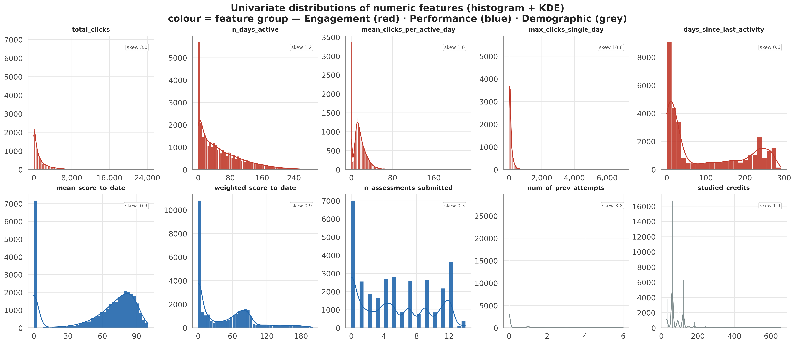
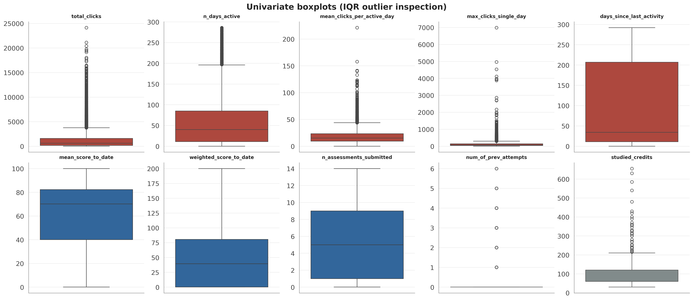
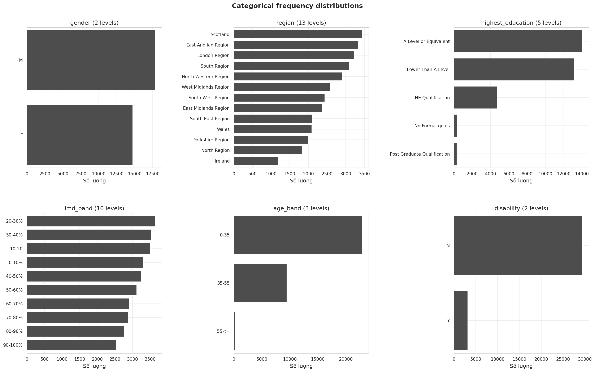

### 4.3 Song biến — biến định lượng với mục tiêu (STT 36)

Kiểm định Mann-Whitney U (hiệu chỉnh BH) cho thấy **cả 19 biến định lượng đều có ý nghĩa** (q < 0,05) — điều dễ hiểu ở n ≈ 32.593 — nên **độ lớn hiệu ứng**, không phải p-value, mới là yếu tố phân biệt. Xếp hạng theo |Cohen's d|:

| Đặc trưng | Nhóm | \|Cohen's d\| |
|---|---|---|
| days_since_last_activity | Tương tác | **2,55** |
| n_assessments_submitted | Kết quả | **2,05** |
| weighted_score_to_date | Kết quả | **1,96** |
| n_days_active | Tương tác | **1,58** |
| mean_score_to_date | Kết quả | **1,58** |

Hành vi và kết quả chiếm ưu thế; nhân khẩu học yếu nhất (`studied_credits` 0,28, `num_of_prev_attempts` 0,21). Bảng kiểm định đầy đủ: `reports/tables/bivariate_numeric_tests.csv`.

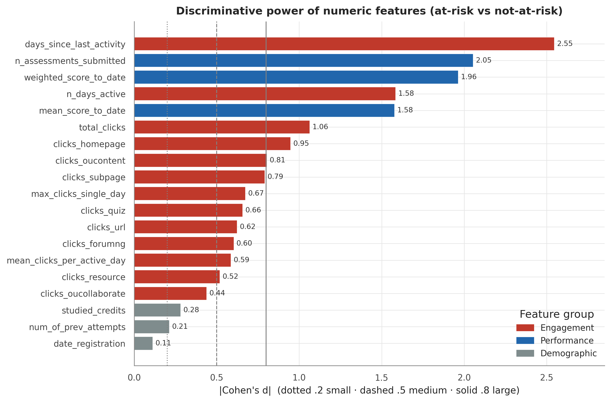
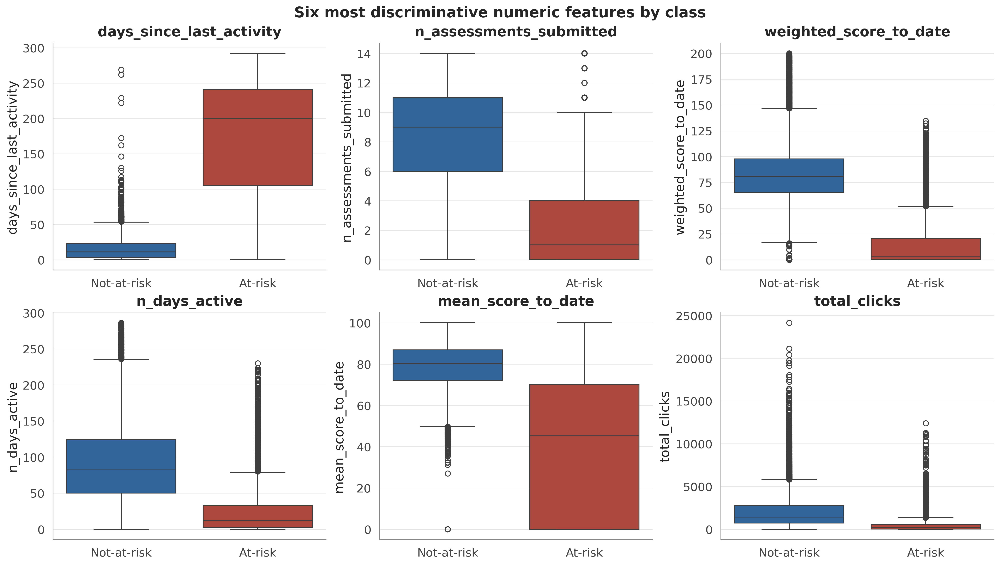

### 4.4 Song biến — biến phân loại với mục tiêu

Kiểm định chi-square có ý nghĩa, nhưng độ lớn hiệu ứng **Cramér's V** đều nhỏ: `highest_education` (0,15) và `imd_band` (0,15) dẫn đầu, còn `gender` (0,02) gần như không đáng kể. Nhân khẩu học mang tín hiệu độc lập hạn chế, nên giữ để phân tích công bằng hơn là dựa vào để dự đoán.

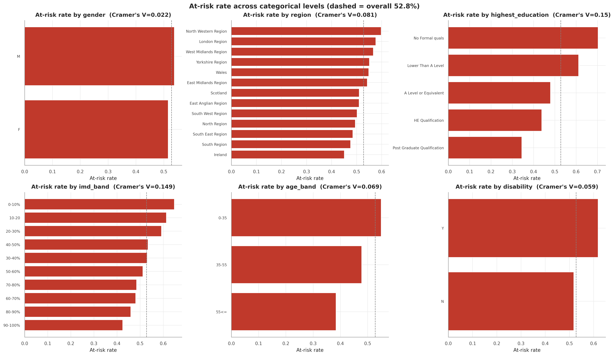

### 4.5 Đa biến — tương quan, đa cộng tuyến, rò rỉ (STT 37)

Pearson và Spearman nhất quán về cấu trúc. Hai cặp đa cộng tuyến (|r| ≥ 0,8): `n_days_active`–`total_clicks` (0,84) và `days_since_last_activity`–`n_assessments_submitted` (−0,83) — liên quan đến độ ổn định giải thích (RQ2). Tương quan mạnh nhất với mục tiêu: `days_since_last_activity` (0,78), `n_assessments_submitted` (0,72), `weighted_score_to_date` (0,71). **Không đặc trưng nào tương quan ≥ 0,95 với mục tiêu**, nên không có đặc trưng đại diện rò rỉ.

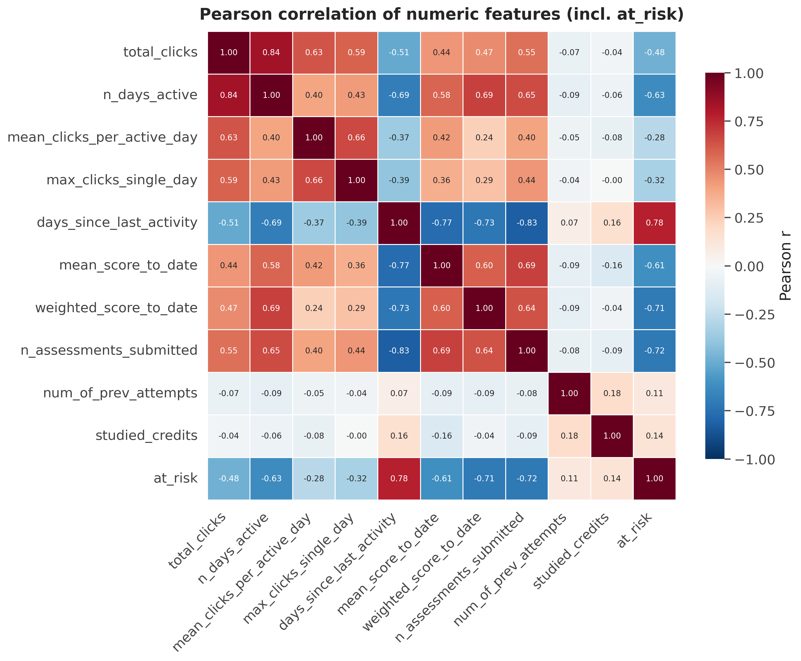
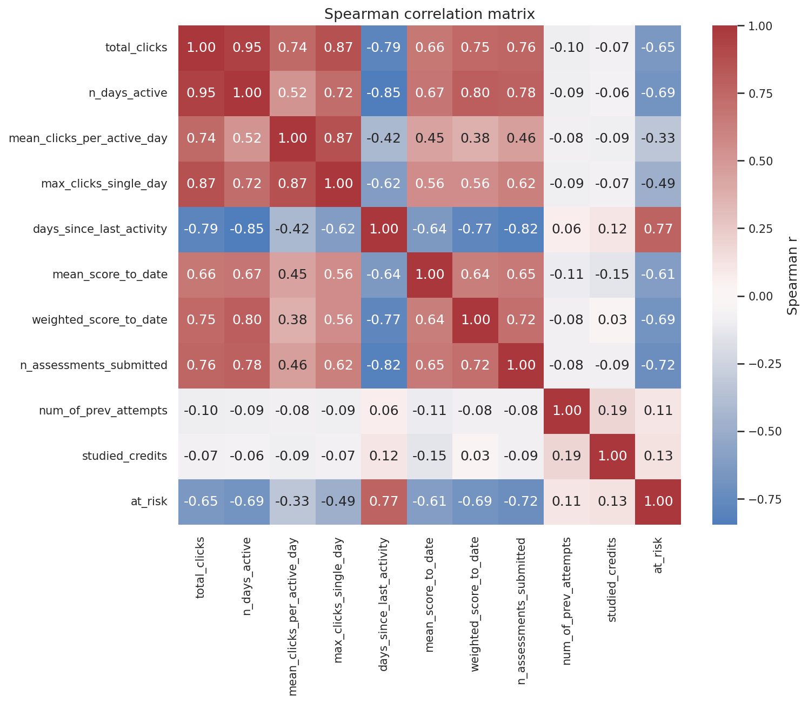
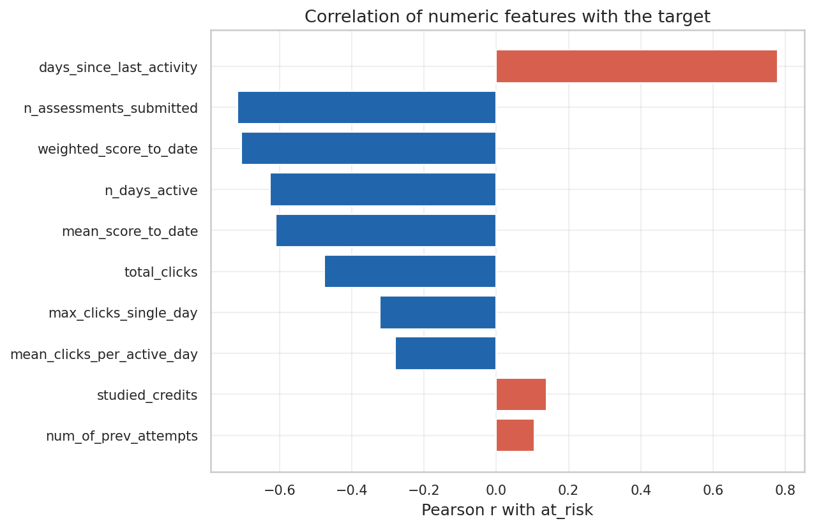

### 4.6 Phân tích theo thời gian — tín hiệu xuất hiện khi nào? (STT 38, RQ1)

Theo dõi **|Cohen's d| theo từng mốc** cho thấy sức phân biệt giữa hai lớp tăng dần theo tiến độ. `n_days_active` đã vượt ngưỡng hiệu ứng lớn (d ≥ 0,8) ngay tại **t = 10%**; các đặc trưng điểm và nộp bài vượt ngưỡng tại **t = 20%**; `days_since_last_activity` tại **t = 40%**. Tín hiệu hành vi do đó khả dụng từ ~20–40% thời lượng khoá học.

| Đặc trưng | mốc *t* sớm nhất có \|d\| ≥ 0,8 |
|---|---|
| n_days_active | 10% |
| mean_score_to_date · n_assessments_submitted · weighted_score_to_date | 20% |
| days_since_last_activity | 40% |
| total_clicks | 60% |

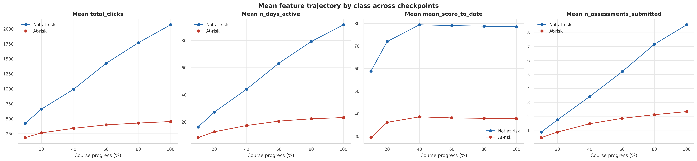
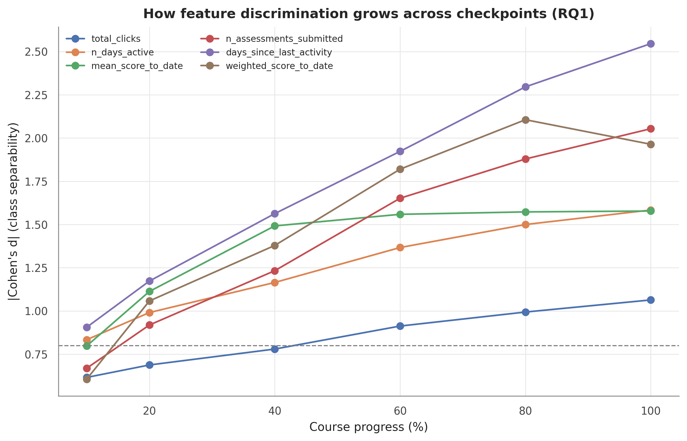

### 4.7 Tín hiệu cảnh báo sớm của sinh viên Withdrawn (Phương án A)

Dữ liệu xác nhận tiền đề của Phương án A rằng việc rút môn tạo ra tín hiệu thật chứ không phải nhiễu: trung vị số ngày không hoạt động là **11 ngày với not-at-risk, 116 với Fail, và 233 với Withdrawn**, còn trung vị tổng click giảm từ **1.425 (not-at-risk) xuống 89 (Withdrawn)**. Sự sụp đổ hoạt động của sinh viên rút môn chính là điều khiến phát hiện sớm khả thi.

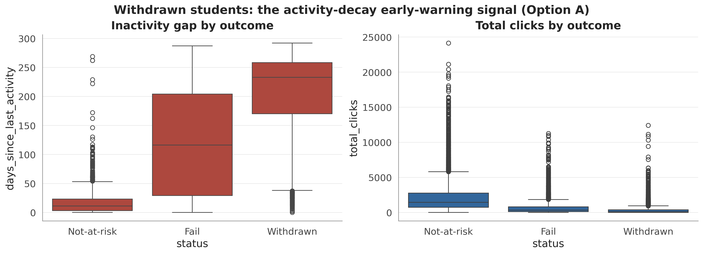

### 4.8 Phát hiện và hàm ý cho mô hình hoá

1. **F1 (RQ1) — tín hiệu sớm và tăng dần.** Đặc trưng hành vi/kết quả phân biệt hai lớp từ t = 10–20% và mạnh dần đơn điệu; 40–60% là vùng ổn định, khả thi (nhất quán với Adnan và cộng sự [1]).
2. **F2 (RQ1/RQ2) — hành vi ≫ nhân khẩu học.** Tương tác/kết quả đạt d > 2 trong khi liên hệ nhân khẩu học nhỏ (Cramér's V ≤ 0,15), tái hiện Tomasevic và cộng sự [2]; SHAP/LIME được kỳ vọng xếp hạng đặc trưng hành vi cao nhất.
3. **F3 (RQ3) — mất cân bằng nhẹ.** Ở mức 52,8% at-risk, tái lấy mẫu có thể cải thiện ít; RQ3 định lượng SMOTE/ADASYN/class-weight so với mốc cơ sở bằng PR-AUC/recall.
4. **F4 (RQ2) — đặc trưng tương quan cao.** Các đặc trưng tương tác đa cộng tuyến có thể làm độ quan trọng giải thích kém ổn định — yếu tố mà chỉ số ổn định phải tính đến.
5. **F5 — không rò rỉ.** Không đặc trưng nào tương quan gần như hoàn hảo với nhãn, và phép cắt theo thời gian loại bỏ sự kiện tương lai; ước lượng trên tập kiểm tra do đó đáng tin cậy.

---

## Tài liệu tham khảo

1. M. Adnan và cộng sự, "Predicting at-Risk Students at Different Percentages of Course Length for Early Intervention," *IEEE Access*, vol. 9, tr. 7519–7539, 2021.
2. N. Tomasevic, N. Gvozdenovic, S. Vranes, "An overview and comparison of supervised data mining techniques for student exam performance prediction," *Computers & Education*, vol. 143, art. 103676, 2020.
3. J. Kuzilek, M. Hlosta, Z. Zdrahal, "Open University Learning Analytics dataset," *Scientific Data*, vol. 4, art. 170171, 2017.
4. S. Gunasekara, M. Saarela, "Explainable AI in Education: Techniques and Qualitative Assessment," *Applied Sciences*, vol. 15, no. 3, art. 1239, 2025.
8. N. V. Chawla và cộng sự, "SMOTE: Synthetic Minority Over-sampling Technique," *JAIR*, 2002.
